### ToC

- [2장. 느려진 서비스, 어디부터 봐야 할까](#2장-느려진-서비스-어디부터-봐야-할까)
  - [응답 시간(Response Time)](#응답-시간response-time)
  - [처리량(Throughput)](#처리량throughput)
  - [병목 지점(Bottleneck) 찾기](#병목-지점bottleneck-찾기)
  - [DB 커넥션 풀](#db-커넥션-풀)
    - [커넥션 풀 크기](#커넥션-풀-크기)
    - [커넥션 대기 시간](#커넥션-대기-시간)
    - [최대 유휴시간, 유효성 검사, 최대 유지 시간](#최대-유휴시간-유효성-검사-최대-유지-시간)
  - [서버 캐시](#서버-캐시)
    - [적중률과 삭제 규칙](#적중률과-삭제-규칙)
    - [로컬(Local) 캐시와 리모트(Remote) 캐시](#로컬local-캐시와-리모트remote-캐시)
    - [캐시 사전 적재](#캐시-사전-적재)
    - [캐시 무효화](#캐시-무효화)
  - [가비지 컬렉터와 메모리 사용](#가비지-컬렉터와-메모리-사용)
  - [응답 데이터 압축](#응답-데이터-압축)
  - [정적 자원과 브라우저 캐시](#정적-자원과-브라우저-캐시)
  - [정적 자원과 CDN](#정적-자원과-cdn)
  - [대기 처리](#대기-처리)
- [3장. 성능을 좌우하는 DB 설계와 쿼리](#3장-성능을-좌우하는-db-설계와-쿼리)
  - [성능에 핵심인 DB](#성능에-핵심인-db)
  - [조회 트래픽을 고려한 인덱스 설계](#조회-트래픽을-고려한-인덱스-설계)
    - [단일 인덱스와 복합 인덱스](#단일-인덱스와-복합-인덱스)
    - [선택도를 고려한 인덱스 컬럼 선택](#선택도를-고려한-인덱스-컬럼-선택)
    - [커버링 인덱스 활용하기](#커버링-인덱스-활용하기)
    - [인덱스는 필요한 만큼만 만들기](#인덱스는-필요한-만큼만-만들기)
  - [몇 가지 조회 성능 개선 방법](#몇-가지-조회-성능-개선-방법)
    - [미리 집계하기](#미리-집계하기)
  - [알아두면 좋을 몇 가지 주의 사항](#알아두면-좋을-몇-가지-주의-사항)
    - [쿼리 타임아웃](#쿼리-타임아웃)
    - [상태 변경 기능은 복제 DB에서 조회하지 않기](#상태-변경-기능은-복제-db에서-조회하지-않기)
    - [배치 쿼리 실행 시간 증가](#배치-쿼리-실행-시간-증가)
    - [타입이 다른 컬럼 조인 주의](#타입이-다른-컬럼-조인-주의)
    - [테이블 변경은 신중하게](#테이블-변경은-신중하게)
    - [DB 최대 연결 개수](#db-최대-연결-개수)
  - [실패와 트랜잭션 고려하기](#실패와-트랜잭션-고려하기)
- [4장. 외부 연동이 문제일 때 살펴봐야 할 것들](#4장-외부-연동이-문제일-때-살펴봐야-할-것들)
  - [타임아웃](#타임아웃)
    - [2가지 타임아웃: 연결 타임아웃, 읽기 타입아웃](#2가지-타임아웃-연결-타임아웃-읽기-타입아웃)
    - [타임아웃간의 차이 정리](#타임아웃간의-차이-정리)
  - [재시도](#재시도)
    - [재시도 가능 조건](#재시도-가능-조건)
    - [재시도 횟수와 간격](#재시도-횟수와-간격)
    - [재시도 폭풍(Retry Storm) 안티패턴](#재시도-폭풍retry-storm-안티패턴)
  - [동시 요청 제한](#동시-요청-제한)
  - [서킷 브레이커](#서킷-브레이커)
  - [외부 연동과 DB 연동](#외부-연동과-db-연동)
    - [외부 연동과 트랜잭션 처리](#외부-연동과-트랜잭션-처리)
    - [외부 연동은 성공했는데 DB 연동에 실패해서 트랜잭션을 롤백](#외부-연동은-성공했는데-db-연동에-실패해서-트랜잭션을-롤백)
    - [외부 연동이 느려질 때 DB 커넥션 풀 문제](#외부-연동이-느려질-때-db-커넥션-풀-문제)
  - [HTTP 커넥션 풀](#http-커넥션-풀)

# 2장. 느려진 서비스, 어디부터 봐야 할까

다양한 지표가 성능과 관련이 있다. 네트워크 속도, 디스크 속도, CPU 속도, 메모리 크기, GC 속도 등 다양한 지표가 성능과 관련이 있다.
이런 다양한 지표 중에서 서버 성능과 관련 있는 중요한 지표를 2가지 꼽자면 응답 시간(Response Time)과 처리량(Throughput)이다.

## 응답 시간(Response Time)

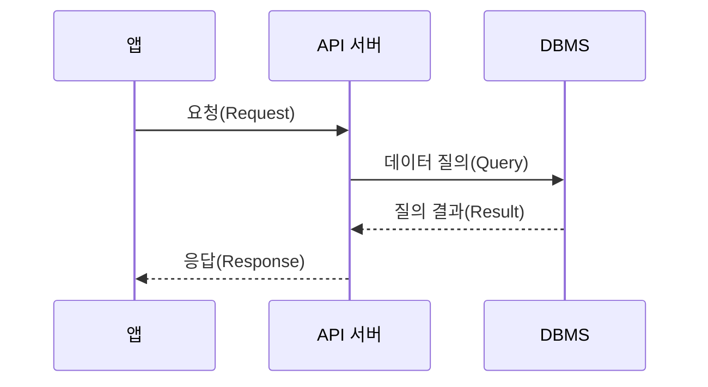

**그림 1.** 앱, API 서버, DBMS 간의 시퀀스 다이어그램

1. API 요청: 서버에 연결 + 서버로 데이터 전송
2. SQL 실행, 응답 생성 등: 서버 실행
3. API 응답: 클라이언트로 데이터 전송

응답 시간은 다음과 같이 2가지로 나누어 측정하기도 한다.

- TTFB(Time to First Byte): 첫 번째 바이트가 도착하기까지의 시간
- TTLB(Time to Last Byte): 마지막 바이트가 도착하기까지의 시간

파일 다운로드처럼 전송할 데이터가 크거나 네트워크 속도가 느리면 TTFB와 TTLB의 차이가 커질 수 있다.

서버 개발자는 주로 서버의 처리 시간을 확인한다. 서버 처리 시간은 다음과 같은 요소를 포함한다.

- 로직 수행(if, for 등)
- DB 연동(SQL 실행)
- 외부 API 연동
- 응답 데이터 생성(전송)

이 중에서도 DB 연동과 외부 API 연동이 큰 비중을 차지한다. 실제 한 요청의 처리 시간을 측정한 결과다.

- 전체 처리 시간: 348ms
- API 연동 1(External API) 186ms(53%)
- API 연동 2(Internal API) 44ms(13%)
- DB 연동(SQL 실행 6회): 101ms(29%)
- 응답 데이터 생성: 17ms(5%)

이처럼 API 연동과 DB 연동이 전체 처리 시간의 대부분을 차지하는 경우가 많다. 이러한 이유로 응답 시간을 줄일 때 DB 연동과 API 연동 시간에 집중한다.

## 처리량(Throughput)

처리량은 단위 시간당 처리할 수 있는 요청의 수를 의미한다. 흔히 TPS(Transaction Per Second: 초당 처리한 트랜잭션 수), RPS(Request Per Second) 등으로 표현한다.

최대 TPS는 시스템이 처리할 수 있는 최대 요청 수를 의미한다. 동시에 들어오는 요청 수가 최대 TPS를 초과하면 서버는 초과한 요청을 나중에 처리한다. 예를 들어, 최대 TPS가 5인 서버에 동시에 7개의 요청이 들어오면 5개는 즉시 처리하고 나머지 2개는 대기한다. 나머지 2개는 5개의 요청이 끝난 후에야 처리된다. 사용자 입장에서는 나중에 처리된 2개의 요청은 **실제 처리된 시간과 더불어서 대기 시간도 포함된다.**

응답 시간의 증가는 사용자 이탈로 이어질 수 있다. 이를 방지하려면 다음 2가지 방법을 고려해야 한다.

1. 서버가 동시에 처리할 수 있는 요청 수를 늘려 대기 시간을 줄인다.
2. 처리 시간 자체를 줄여 대기 시간을 줄인다.

> [!TIP]
> 성능을 개선하려면 먼저 현재 서버의 TPS와 응답 시간을 알아야 한다.
> 막연히 성능이 느리다 말하면서 이것저것 시도하면 안 된다.
> 트래픽이 많은 시간대의 TPS와 응답 시간이 얼마인지 측정하고,
> 이 결과를 바탕으로 목표 TPS와 응답 시간을 설정하고 효과적인 성능 개선안을 도출해야한다.
>
> **TPS를 확인하는 가장 간단한 방법은 모니터링 시스템을 활용하는 것이다.**

## 병목 지점(Bottleneck) 찾기

트래픽이 증가하면서 성능 문제가 발생하는 주된 이유는 시스템이 수용할 수 있는 최대 TPS를 초과하는 트래픽이 유입되기 때문이다. 시스템이 제공할 수 있는 최대 TPS를 높이지 않으면 증가하는 트래픽을 적절히 처리할 수 없다.

TPS를 높이려면 먼저 성능 문제가 발생하는 지점을 찾아야 한다. 문제 지점을 찾는 간단한 방법은 처리 시간이 오래 걸리는 작업을 식별하는 것이다.

TPS를 높이기 위해 무턱대고 서버를 추가해서는 안 된다.

> [!TIP]
>
> **병목 지점(Bottleneck)을 확인하는 가장 간단한 방법은 APM 시스템을 활용하는 것이다.**

## DB 커넥션 풀

DB를 사용하려면 다음과 같이 3단계의 과정이 필요하다.

1. DB에 연결한다.
2. SQL을 실행한다.
3. 사용이 끝나면 DB 연결을 종료한다.

서버와 DB는 네트워크 통신을 통해 연결된다. 이때 네트워크 연결을 생성하고 종료하는 데 걸리는 시간은 0.5초에서 1초 이상 소요되기도 한다. 이 시간이 길게 느껴지지 않을 수도 있지만 실제로는 매우 긴 시간이다. 예를 들어, 10ms에 불과한 짧은 쿼리를 실행하기 위해 연결과 종료에 50ms(0.05초)가 소요된다면 전체 처리 시간은 60ms(0.06초)가 된다. 단순히 계산해도 전체 처리 시간의 80% 이상이 DB 연결 및 종료에 쓰이게 된다.

매 요청마다 DB를 연결하고 종료하면 트래픽이 증가하면 이러한 현상은 더 두드러진다. 매 요청마다 DB를 연결하고 종료하면 트래픽이 증가할 때 급격하게 처리량이 떨어지기도 한다. 이런 문제를 피하기 위해 DB 커넥션 풀을 사용한다. DB 커넥션 풀은 DB에 연결된 커넥션을 미리 생성해서 보관한다. 애플리케이션은 DB 작업이 필요할 때 풀에서 커넥션을 가져와 사용하고, 작업이 끝나면 다시 풀에 반환한다.

커넥션 풀 설정중 중요한 설정은 다음과 같다.

- 커넥션 풀 크기(또는 최소, 최대 크기)
- 풀에 커넥션이 없을 때 커넥션을 구할 때까지 대기할 시간
- 커넥션의 유지 시간(최대 유휴 시간, 최대 유지 시간)

### 커넥션 풀 크기

커넥션 풀 크기는 커넥션 풀에 보관할 수 있는 커넥션의 개수를 의미한다. 서버는 주로 DB와 통신을 하기 때문에, DB 커넥션 풀 크기를 잘못 설정하면 성능에 큰 영향을 미친다. 다음과 같은 상황을 가정해보자.

- 커넥션 풀 크기는 5다.
- 한 요청에서 쿼리를 실행하는데 1초 걸린다.
- 계산을 쉽게 하기 위해 데이터 전송 시간은 무시한다.

서버에 6개 요청이 동시에 들어왔을 때 이 중 5개 요청은 풀에서 커넥션을 가져올 수 있다. 반면 1개 요청은 다른 요청이 커넥션을 반환할 때까지 대기해야 한다.

커넥션 풀의 구현 방식에 따라 다르지만 일반적인 커넥션 풀은 최소 크기와 최대 크기를 설정할 수 있다. 최소 크기는 커넥션 풀에 항상 유지할 커넥션의 개수를 의미한다. 커넥션 풀의 크기를 5로 설정하고 최소 크기를 2로 설정하면 커넥션 풀은 항상 2개의 커넥션을 유지한다. 나머지 3개는 필요할 때마다 생성된다. 이때 커넥션 풀의 크기를 5로 설정하면 최대 5개의 커넥션을 유지할 수 있다.

> [!Tip]
> 트래픽이 순간적으로 급증하는 패턴을 보인다면 커넥션 풀의 최소 크기를 최대 크기에 맞추는 것이 좋다.
> 트래픽이 점진적으로 증가할 때는 DB 연결 시간이 성능에 큰 영향을 주지 않지만 트래픽이 급증할 때는
> DB 연결도 성능 저하의 주요 원인이 될 수 있기 때문이다.

### 커넥션 대기 시간

대기 시간이란 풀에 사용할 수 있는 커넥션이 없을 때 커넥션을 얻기 위해 기다릴 수 있는 최대 시간을 의미한다. 지정된 대기 시간 안에 커넥션을 얻지 못하면 DB 연결 실패 에러가 발생한다.

> [!Tip]
> 따라서 응답 시간이 중요한 서비스는 커넥션 대기 시간을 가능한 한 짧게 설정해야 한다.
> 트래픽의 양이나 서비스의 특성에 따라 차이는 있지만 보통의 경우라면 0.5초에서 3초 이내로 지정하자.
> **모니터링 시스템(APM 등)을 통해 커넥션 대기 시간, 실패율, 응답 시간 등의 지표를 수집한다.**  
> **실시간성이 중요한 서비스라면 짧게, 배치성이나 대기 허용 서비스라면 길게 설정한다.**  
> **금융 거래처럼 반드시 처리가 되어야 하는 경우라면 대기 시간을 더 길게 설정한다.**
>
> **실제 적용 방법**
>
> 1. 초기에는 0.5초~3초로 설정한다. (예: 500ms ~ 3000ms)
> 2. 모니터링
>
>    - 커넥션 풀에서 대기 시간이 자주 발생하는지
>    - 대기 시간 초과로 실패하는 요청이 얼마나 되는지 모니터링
>
> 3. 조정
>
>    - 대기 시간 초과가 많으면 풀 크기를 늘리거나, 대기 시간을 늘리거나, 쿼리 성능을 개선하는 튜닝이 필요하다.

대기 시간을 짧게 설정하면 커넥션 풀이 모두 사용중일 때 빠르게 '일시적 오류'와 같은 에러 응답을 사용자에게 보여줄 수 있다. 에러를 응답하는게 부정적으로 보일 수도 있다.
하지만 대기 시간 때문에 긴 시간 동안 무응답 상태가 되는 것보다는 나을 수 있다. 커넥션을 얻지 못했을 때 에러를 응답해야 서버의 부하가 증가하는 것도 방지할 수 있다.

### 최대 유휴시간, 유효성 검사, 최대 유지 시간

근무 시간대에는 지속적으로 서버에 요청이 들어오지만 새벽 시간대에는 요청이 거의 없을 것이다. 요청이 없는 시간대에는 풀에 있는 커넥션도 사용되지 않는다.
이때 주의할 점이 있다. 커넥션이 사용되지 않는 시간이 길어지면 연결이 끊길 수 있다.

DB와의 연결이 끊긴 커넥션을 사용하면 에러가 발생한다. 이러한 연결 끊김으로 인해 발생하는 에러를 방지하기 위해 커넥션 풀은 다음 2가지 기능을 제공한다.

- 최대 유휴시간(Maximum Idle Time) 지정
- 유효성 검사(Validation) 지원

최대 유휴 시간은 사용되지 않는 커넥션을 풀에 유지할 수 있는 최대 시간을 의미한다.
최대 유휴 시간을 30분으로 설정하면 30분 이상 사용되지 않은 커넥션은 종료되어 풀에서 제거된다.
이 시간을 DB에 설정된 비활성화 유지 시간보다 짧게 설정하면, DB가 연결을 끊기 전에 풀에서 커넥션을 제거할 수 있다.

유효성 검사는 커넥션이 정상적으로 사용할 수 있는 상태인지 여부를 확인하는 절차이다.
이 과정을 통해 커넥션 풀에 존재하는 커넥션 중 연결이 유요하지 않은 커넥션을 식별하고 풀에서 제거할 수 있다.
일부 커넥션 풀은 유효성 검사를 위해 실제 쿼리를 실행하기도 한다. 이때는 `SELECT 1`, `SELECT 1 FROM DUAL`과 같은 간단한 쿼리를 사용한다.

커넥션 풀이 제공하는 또 다른 설정은 최대 유지 시간이다. 이 갑싱 4시간으로 설정되면 커넥션은 생성된 후 최대 4시간 동안만 유지된다. 4시간이 지나면 커넥션은 유효하더라도 커넥션을 닫고 풀에서 제거된다.

> [!TIP]
> 최대 유휴 시간과 최대 유지 시간을 무한대로 설정하지 않는 것이 좋다.
> 커넥션 풀의 기본값을 확인한 뒤 이 두 설정의 기본값이 무제한으로 되어 있다면 DB 설정을 참고하여 알맞게 적절한 값으로 지정해야 한다.

## 서버 캐시

DB 서버를 수평 확장하더라도 처리량을 늘릴 수 있지만 실행 시간이 획기적으로 줄어들지는 않는다.
DB 서버를 확장하지 않고도 응답 시간과 처리량을 개선하고 싶다면 캐시(Cache) 사용을 고려할 수 있다.

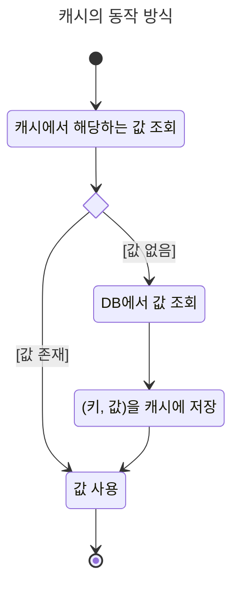

> [!NOTE]
> 적절한 캐시 키를 선택해야한다. 예를 들어
> 게시글 상세 정보는 "artices:번호" 형태의 캐시 키를 사용하고 최신 인기 글은 "articles:hot10" 형태의 캐시 키를 사용하는 식이다.
> 또한 캐시를 사용할 때는 캐시 키가 겹치지 않도록 주의해야 한다.

### 적중률과 삭제 규칙

캐시에 보관할 수 있는 데이터에 제한이 있으므로, 캐시가 가득 차 있는 상태에서 데이터를 캐시에 저장하면 기존에 있는 데이터 중 하나를 제거해야 한다.
삭제할 대상을 선택할 때 주로 사용하는 규칙은 다음과 같다.

- LRU(Least Recently Used): 가장 오래전에 사용된 데이터를 삭제한다.
- LFU(Least Frequently Used): 가장 적게 사용된 데이터를 삭제한다.
- FIFO(First In First Out): 먼저 추가된 데이터를 삭제한다.

오래된 데이터는 캐시에 있어도 사용되지 않을 가능성이 크다.
따라서 캐시가 가득 차 있지 않더라도 오래된 데이터는 미리 삭제하는 것이 좋다.
이를 위해 캐시에는 유효 시간(TTL, i.g.만료 시간)을 설정하는 방식도 함께 사용한다.

### 로컬(Local) 캐시와 리모트(Remote) 캐시

서버가 사용하는 캐시는 크게 두 종류가 있다. 첫 번째는 로컬(Local) 캐시다.
로컬 캐시는 서버 프로세스와 동일한 메모리를 캐시 저장소로 사용한다.
두 번째는 리모트(Remote) 캐시다. 리모트 캐시는 별도 프로세스를 캐시 저장소로 사용한다.

로컬 캐시 구현 기술로는 Caffeine(Java), go-cache(Go), node-cache(Node.js)등이 있다.
로컬 캐시의 장점은 속도에 있다.
또한 별도의 외부 연동이 필요하지 않아 구조를 단순하게 유지할 수 있다.

| 구분          | 로컬(Local) 캐시                                                                                                                                           | 리모트(Remote) 캐시                                                                                                                                                |
| :------------ | :--------------------------------------------------------------------------------------------------------------------------------------------------------- | :----------------------------------------------------------------------------------------------------------------------------------------------------------------- |
| **장점**      | - 매우 빠른 응답 속도 (메모리 접근)<br>• 네트워크 지연 없음<br> - 구현이 단순하고 외부 의존성 없음<br> - 외부 시스템 연동 불필요                           | - 여러 서버 간 캐시 데이터 공유 가능<br> -서버 확장에도 일관된 캐시 유지<br> - 서버 재시작해도 캐시 유지<br> - 대용량 데이터 캐싱 가능<br> - 중앙 집중식 캐시 관리 |
| **단점**      | - 서버마다 별도 캐시 관리 필요<br> - 서버 재시작 시 캐시 소실<br> - 서버 간 캐시 데이터 불일치 발생<br> - 메모리 제약으로 캐시 크기 제한<br> - 확장성 제한 | - 네트워크 지연 발생<br> - 외부 시스템 의존성 증가<br> - 구현 및 운영 복잡도 증가<br> - 네트워크 비용 발생<br> - 외부 서비스 장애 시 영향                          |
| **적합 사례** | - 변경이 적은 정적 데이터<br> - 서버별 독립적 데이터<br> - 초고속 응답이 필요한 경우<br> - 단일 서버 환경                                                  | - 다중 서버 환경<br> - 일관된 캐시 데이터 필요 시<br> - 대규모 캐시 데이터 필요 시<br> - 서버 재시작에도 데이터 유지 필요 시                                       |
| **구현 기술** | - Caffeine (Java)<br> - go-cache (Go)<br> - node-cache (Node.js)                                                                                           | - Valkey<br> - Memcached<br> - Hazelcast                                                                                                                           |

로컬 캐시와 리모트 캐시는 각각 장단점이 뚜렷하기 때문에 상황이나 용도에 맞게 선택해야 한다.
어떤 방식을 무조건 선택해야 한다는 절대적인 기준은 없으며 데이터 규모, 변경 빈도, 응답 시간, 처리량 등을 판단 기준으로 결정해야 한다.

캐시에 보관할 데이터 규모가 작고 변경 빈도가 매우 낮다면 로컬 캐시로 충분하다.
예를 들어 홈 화면에 표시할 최신 공지글 목록을 생각해보자. 보통 이 목록은 많아야 10개 미만이다.
또한 몇 시간에서 며칠 동안 동일할 때가 많다.
이처럼 자주 바뀌지 않고 크기가 작은 데이터는 로컬 캐시를 사용하기에 적당하다.

반면에 데이터 규모가 크다면 리모트 캐시를 사용해야 한다.
대형 이커머스 사이트의 개별 제품 정보가 그 예다.
로컬 캐시로는 메모리 용량 등의 한계로 대응이 어렵다.
일부 데이터를 로컬 캐시에 저장하더라도 데이터가 수시로 변경되면 캐시 효율도 떨어진다.

### 캐시 사전 적재

트래픽이 순간적으로 급증하는 패턴을 보인다면 캐시에 데이터를 미리 저장하는 것도 고려할 필요가 있다.
다음은 캐시에 미리 데이터를 저장하면 큰 효과를 볼 수 있는 가상의 사례다.

- G 앱 사용자는 300만명
- 매달 정해진 날에 이달의 요금 정보를 보여준다.
- 해당 일자가 되면 전체 회원을 대상으로 요금 안내 푸시 알림을 발송한다.
- 푸시를 받은 사용자 중 일부는 이달의 요금 정보를 조회한다.

대응 방법은 캐시에 데이터를 미리 넣어두는 것이다.
각 사용자의 요금 정보를 캐시에 저장해두면 푸시를 받은 사용자가 한꺼번에 몰려올 때도 캐시 적중률을 99%에 가깝게 유지할 수 있다.
이를 통해 순간적으로 트래픽이 몰렸을 때도 응답 시간을 안정적으로 유지할 수 있으며, DB에 부하가 집중되는 현상도 효과적으로 방지할 수 있다.

### 캐시 무효화

캐시에 보고나된 데이터의 원본이 바뀌면, 그에 맞춰 캐시에 보관된 데이터도 함께 변경하거나 삭제해야 한다.
원본이 변경됐는데 캐시에 저장된 데이터가 갱신되지 않으면 사용자는 오래된 잘못된 정보를 확인하게 되는 문제가 발생할 수 있다.

캐시에 저장된 데이터의 특성에 따라 캐시를 무효화하는 시점을 달리 설정해야 한다.
가격 정보, 게시글 내용처럼 민감한 데이터는 변경되는 즉시 캐시를 무효화해야 한다.
게시글 내용을 수정했는데도 캐시가 그대로 유지되면 사용자는 수정 전 게시글 내용을 보게 되어 혼란을 겪을 수 있다.
작성자는 수정이 제대로 반영되지 않았다고 생각해 오류 신고를 하거나 서비스에 대한 신뢰도를 낮게 평가할 수 있다.

변경에 민감한 데이터는 로컬 캐시가 아닌 리모트 캐시에 보관해야 한다.
A 서버에 연결한 사용자는 변경된 가격 정보를 보지만 B 서버에 연결한 사용자는 B 서버의 로컬 캐시에 보관된 변경전 가격 정보를 보게 되는 문제가 발생할 수 있어 서비스 신뢰성에 큰 영향을 줄 수 있다.

변경에 민감하지 않고 데이터 크기가 작다면 캐시의 유효 시간을 설정하여 주기적으로 갱신하는 방식을 사용해도 된다.
예를 들어, 최근 인기 글 목록을 캐시에 저장한 경우, 최근 인기 글 목록이 바뀌고 몇 분 뒤에 캐시 데이터가 변경되더라도 서비스에 심각한 문제는 일어나지 않는다.
인기 글 목록을 저장하는 캐시의 유효 시간을 10분으로 지정하면 10분 주기로 최신 인기 게시글 목록을 갱신하는 효과를 얻을 수 있다. 갱신 시간을 줄이고 싶으면 유효 시간을 10분에서 5분으로 줄이기만 하면 된다.

## 가비지 컬렉터와 메모리 사용

가비지 컬렉터(Garbage Collector, GC)를 사용하는 언어는 사용이 끝난 객체를 힙 메모리에서 바로 삭제하지 않고 정해진 규칙에 따라 사용하지 않는 메모리를 정리한다.

메모리를 많이 사용하고 생성된 객체가 많을수록 사용하지 않는 객체를 찾는 데 시간이 오래 걸린다.
GC 알고리즘과 메모리 사용 패턴에 따라 차이가 있지만 사용하는 메모리양과 객체 수가 많을 수록 GC가 실행되는 시간이 길어진다.

반대로 메모리 사용을 줄이면 GC가 실행되는 시간도 줄어든다.
물론 실제 애플리케이션이 4GiB에 가까운 메모리가 있어야 하는데도 2GiB로 설정하면 OOM(Out Of Memory) 에러가 발생할 수 있으므로 실제 메모리 사용 패턴에 맞게 최대 힙 크기를 조정해야 한다.

한 번에 대량으로 객체르 생성하는 것도 주의해야 한다.
게시글 하나가 0.5KiB라고 가정했을 때 10만 개의 게시글은 대략 50MiB의 메모리를 사용한다.
만약 동시에 100명 사용자가 게시글을 조회한다면 5GiB의 메모리를 사용하게 된다.
사용할 수 있는 최대 메모리가 4GiB라면 OOM 에러가 발생할 수 있다.

대량으로 객체가 생성되는 것을 방지하려면 조회 범위를 제한해야 한다.
10년 치 거래 내역을 한버에 조회할 수 있도록 하기보다는 최대 3개월 치만 조회할 수 있도록 한다.
마찬가지로 한 번에 조회할 수 있는 데이터의 개수도 트래픽 규모와 메모리 크기에 맞춰 제한해야 한다.

파일 다운로드와 같은 기능을 구현할 때는 스트림을 활용한다.
다음 자바 코드 처럼 파일 데이터를 한꺼번에 메모리에 로딩한 후에 응답하는 방식은 피해야 한다.
파일 크기와 동시 사용자 수에 따라 메모리 사용량이 급증할 수 있기 때문이다.
이 코드는 30MiB 크기의 파일을 100명이 동시에 다운로드하면 3GiB의 메모리를 사용하게 된다.

```java
var bytes = Files.readAllBytes(Paths.get("file.txt")); // 파일을 한 번에 메모리에 로딩
out.write(bytes);
```

스트림을 활용하면 파일 처리 과정에서 필요한 메모리 크기를 줄일 수 있다. 다음은 스트림을 이용하도록 변환한 코드이다.

```java
InputStream in = Files.newInputStream(Paths.get("file.txt")); // 파일을 스트림으로 읽기
byte[] buffer = new byte[8192]; // 8KiB 버퍼

int read;
while ((read = in.read(buffer)) != -1) {
    out.write(buffer, 0, read); // 버퍼에 있는 데이터만 전송
}
```

이 코드는 파일을 한 번에 읽지 않고 8KiB씩 끊어 읽는다. 동시에 100명이 다운로드를 요청하더라도 메모리 사용량은 800KiB에 불과하다. 파일 전체를 한 번에 메모리에 로딩하는 방식은 3GiB의 메모리를 사용하지만 스트림을 이용하면 800KiB의 메모리만 사용한다. 이처럼 스트림을 활용하면 메모리 사용량을 줄일 수 있다.

> [!NOTE]
> 문제 원인을 분석하기 위해 힘 덤프를 저장하고 서버를 재시작했다.
>
> 엑셀 다운로드 기능을 실행 → 조회한 데이터가 수백만 건 → 모든 데이터가 메모리에 로딩됨  
> → 엑셀 생성 시간이 길어지자 사용자는 요청을 취소하고 다시 요청함  
> → OOM 발생

> **해결:**
>
> - 엑셀을 메모리에서 생성하지 않고 로컬 파일에 스트림 형태로 만들도록 변경
> - DB에서 조회한 결과를 리스트로 한 번에 받아 처리하던 것을 스트림 형태로 받아 순차적으로 처리하는 방식으로 변경

## 응답 데이터 압축

응답 시간에는 데이터 전송 시간이 포함된다. 이 전송 시간은 2가지 요인에 영향을 받는다.

- 네트워크 속도
- 전송 데이터 크기

사용자의 네트워크 속도가 느리면 응답 시간이 길어진다.
하나의 무선 공유기에 너무 많은 사용자가 붙었을 때 웹사이트가 느려지는 것과 같은 원리다.
전송할 데이터의 크기가 커도 응답 시간이 길어진다.
10KiB 크기의 파일을 다운로드받는 시간 보다 1GiB 크기의 파일을 다운로드받는 시간이 더 긴 것과 같다.

서버는 사용자즈이 네트워크 속도를 제어할 수 없지만 전송하는 데이터의 크기는 제어할 수 있다.
이때 사용할 수 있는 방법은 응답 데이터를 압축해서 전송하는 것이다.
실제로 gzip으로 압축하면 데이터 크기를 50% 이상 줄일 수 있다.
전송 크기가 줄어든 만큼 응답 시간도 줄어든다.
데이터 전송량을 줄이는 것은 응답 시간뿐만 아니라 비용에도 영향을 준다.
Nginx와 같은 웹 서버는 압축 기능을 제공하고 있으므로 약간의 설정만 추가하면 즉시 효과를 볼 수 있다.

> [!NOTE]
> 웹 브라우저나 HTTP 클라이언트는 Accept-Encoding 헤더를 통해 서버에 처리할 수 있는 압축 알고리즘을 알린다.
> 예를 들어, gzip, deflate 알고리즘을 사용해서 압축을 풀 수 있다면 다음과 같이 헤더를 설정한다.]
>
> ```text
> Accept-Encoding: gzip, deflate
> ```
>
> 웹 서버는 Accept-Encoding 헤더를 확인한 후 지원하는 압축 알고리즘으로 응답 데이터를 압축한다.
> 이때 사용된 압축 알고리즘은 Content-Encoding 헤더에 포함되어 응답된다.
>
> **📜 핵심 정리**
>
> - 압축은 가장 바깥 레이어에서 1회만 처리하는 것이 좋다.
> - 이중 압축 = 데이터 전송 효율성 ↓ + CPU 낭비 ↑ + 오류 ↑
> - Best case: Reverse Proxy 혹은 Load Balancer에서 압축 + 애플리케이션은 순수 데이터 전송

응답 데이터를 압축할 때는 다음과 같은 점을 고려해야 한다.

- html, css, js와 같은 텍스트 파일은 압축률이 높다. 반면 jpeg, zip 파일 처럼 이미 압축된 파일은 압축률이 낮다. 따라서 모든 파일에 압축을 적용하는 것보다는 텍스트 파일에만 압축을 적용하는 것이 좋다.
- 웹 서버(HAProxy, Nginx, etc.)에 압축을 적용했더라도 방화벽이 이를 해제해 응답할 수 있다.

## 정적 자원과 브라우저 캐시

서버는 2가지 종류의 데이터를 응답한다. 하나는 동적 데이터, 다른 하나는 정적 데이터다.
동적 자원은 브라우저가 요청할 때마다 결과가 바뀌는 데이터로 제품 목록 HTML 이나 제품 상세 JSON과 같은 데이터다.
정적 자원은 요청할 때마다 결과가 바뀌지 않는 데이터로 이미지, CSS, JS 파일과 같은 데이터다.
정적 자원은 전체 트래픽에서 상당한 비중을 차지한다. 이미지가 많은 온라인 쇼핑몰 사이트의 경우 전체 트래픽의 80%를 차지하기도 한다.

서버가 전송하는 트래픽을 줄이면서 브라우저가 정적 자원을 캐시할 수 있도록 설정하는 것이 좋다.
HTTP 프로토콜에서는 데이터를 응답할 때 Cache-Control 헤더를 통해 브라우저 캐시 설정을 지원한다.

```text
Cache-Control: max-age=60
```

## 정적 자원과 CDN

브라우저 캐시를 사용하면 네트워크 트래픽을 줄일 수 있지만, 브라우저 캐시는 브라우저 단위로 동작하기 때문에 동시에 많은 사용자가 요청할 경우 순간적으로 많은 양의 이미지, JS, CSS 파일을 전송하게 된다. 이로 인해 빠르게 네트워크가 포화되어 응답 시간이 급격하게 느려진다. 4차선 도로(대역폭)에 차가 1~2대씩 지나가면 막힘없이 잘 통과하지만 수십 대의 차가 몰리면 도로가 막히는 것과 같은 원리다.

이런 문제를 해결하는 방법 중 하나가 CDN(Content Delivery Network)이다.
이름에서 알 수 있듯이 CDN은 콘텐츠를 제공하기 위한 별도의 네트워크를 의미한다.
사용자는 CDN이 제공하는 서버에 요청을 보내고 CDN은 사용자의 요청을 처리하기 위해 가장 가까운 CDN 엣지 서버(Edge Server)에 요청을 전달한다.
CDN 서버에 요청한 콘텐츠가 없으면 오리진 서버(Origin Server)에서 콘텐츠를 가져온다.
오리진 서버에 읽어온 콘텐츠는 CDN 서버에 캐시된다.

## 대기 처리

사용자가 순간 폭증할 때가 있다. 대표적인 에가 콘서트 예매다.
이렇게 짧은 시간 동안 폭증하는 트래픽은 어떻게 처리해야 할까? 서버 증설, DB 증설 ...
짧은 시간을 버티기 위해서 투입해야 하는 비용이 크다.
또한 클라우드에서 증설한 서버는 다시 줄일 수 있지만 DB는 그렇지 않다. 최대 트래픽에 맞춰 DB 성능을 Scale Up하면 다시 DB 성능을 줄이기가 어렵다.
전체 서비스 시간 1%도 되지 않는 시간을 위해 고정 비용(DB 비용)이 커지는 격이다.

이런 문제를 해결하기 위해 대기 처리 시스템을 도입할 수 있다.
처리할 수 있는 시스템의 처리량을 무작정 늘리기보다는 수용할 수 있는 수준의 트래픽만 받아들이고 나머지는 대기 처리 하는 것이다.

> [!NOTE]
> 서버 개발자는 대규모 트래픽 대응을 위한 아키텍처 + 비용 절감 방안을 고민해야 한다.

# 3장. 성능을 좌우하는 DB 설계와 쿼리

## 성능에 핵심인 DB

DB 성능은 연동하는 모든 서버 성능에 영향을 준다.
쿼리 실행 시간이 길어지면서 전체 서비스가 느려지는 현상이 발생할 수 있다.

> [!NOTE]  
> **풀 스캔(Full Scan)**  
> 풀 스캔은 DB 테이블에 있는 모든 데이터를 읽는 것을 의미한다.
> 풀 스캔은 인덱스를 사용하지 않고 테이블에 있는 모든 데이터를 읽기 때문에 성능이 저하된다.
> 데이터 개수가 적을 때는 풀 스캔을 사용해도 성능에 큰 영향을 주지 않지만 데이터 개수가 많아지면 응답 시간이 기하급수적으로 늘어난다.

## 조회 트래픽을 고려한 인덱스 설계

DB 테이블 설계할 때는 조회 기능과 트래픽을 고려해야 한다.

풀 스캔이 발생하지 않도록 하려면 조회 패턴을 기준으로 인덱스를 설계해야 한다.
게시판의 경우 카테고리별로 게시글 목록을 조회하는 패턴이 존재하므로 category 컬럼에 인덱스를 추가해서 조회 성능을 개선할 수 있다.

> [!NOTE] > **전문 검색 인덱스**
>
> ```sql
> select * from article
> where content like '%검색어%'
> ```
>
> 그런데 중간에 포함된 단어를 검색하기 위한 Like 쿼리는 인덱스를 사용할 수 없다.
>
> 엘라스틱서치(Elasticsearch)와 같은 전문 검색 인덱스를 사용하면 풀 스캔을 피할 수 있다.
> 하지만 별도의 검색 엔진을 구성하기 힘든 상황이라면 DB에서 제공하는 전문 검색 기능을 사용할 수 있다.
> 예를 들어, Oracle Text나 MySQL의 FULLTEXT 인덱스를 사용하여 전문 검색을 지원한다.

### 단일 인덱스와 복합 인덱스

사용자의 모든 활동 내역을 보관하기 위해 activty_log 테이블을 설계했다고 가정하자.
일 평균 방문 회원이 10만 명이고, 평균 5번의 활동을 한다면, 한 달이면 1,500만 건의 로그가 쌓인다.

고객 센터에서 특정 사용자의 일자병 활동 내역을 조회하는 목적으로 activity_log 테이블을 사용한다고 가정하자.
다음 쿼리를 사용해서 활동 내역을 조회할 것이다.

```sql
SELECT * FROM activity_log
WHERE userId = 1234
AND activityDate BETWEEN '2025-05-01' AND '2025-05-18';
```

- 단일 인덱스: userId만 인덱스를 사용
- 복합 인덱스: (userId, activityDate)를 인덱스로 사용

사용자당 가질 수 있는 데이터가 얼마나 될지 가늠해보면 어떤 인덱스를 사용해야 할지 판단하는 데 도움이 된다.
데이터가 많지 않다면 단일 인덱스를 사용해도 성능에 큰 영향을 주지 않는다.
하지만 사용자당 수만 건이 넘는 데이터가 쌓일 수 있다면, 복합 인덱스를 사용해야 한다.

```sql
select activityDate, activityType, count(activityType)
from activity_log
where activityDate = '2025-05-01'
group by activityType
```

인덱스가 (activityDate, activityType) 순서로 되어 있으면, 인덱스 자체가 이미 activityDate별로 정렬되어 있고, 그 안에서 activityType별로도 정렬되어 있습니다. MySQL(혹은 다른 RDBMS)이 인덱스만 읽으면서 바로 그룹핑/집계를 할 수 있습니다. 즉, 인덱스 스캔만으로 결과를 빠르게 만들 수 있습니다.

그렇기에 해당 쿼리에서는 복합 인덱스가 유리합니다.

### 선택도를 고려한 인덱스 컬럼 선택

인덱스를 생성할 때는 선택도(Selectivity)를 고려해야 한다.
선택도는 인덱스에서 특정 컬럼의 고유한 값 비율을 의미한다.
선택도가 높으면 해당 컬럼에 고유한 값이 많다는 뜻이며, 선택도가 낮으면 고유한 값이 적다는 뜻이다.
선택도가 높을수록 인덱스를 이용한 조회 효율이 높아진다.

아래의 회원 테이블을 보자.

```sql
CREATE TABLE member (
    id INT NOT NULL PRIMARY KEY,
    gender char(10),
    ... 생략
);
```

gender 컬럼은 MALE, FEMALE, NOT_SPECIFIED 3개 값 중 하나를 갖고, gender 컬럼을 인덱스로 사용한다고 하자.
전체 회원 데이터 중 MALE 50만 개, FEMALE 50만 개, NOT_SPECIFIED이 천 개일 때 다음 쿼리를 실행하면 여전히 50만 개의 데이터를 확인해야 한다. 선택도가 낮아 인덱스 효율이 떨어진다.

```sql
select * from member
where gender = 'FEMALE' and birthyear = 1997;
```

인덱스로 사용할 컬럼이 선택도가 항상 높아야 하는 것은 아니다.

```sql
CREATE TABLE member (
    id INT NOT NULL PRIMARY KEY,
    `status` char(10) not null,
);
```

status 컬럼은 WAITING, PROCESSING, COMPLETED 3개 값 중 하나를 갖고, status 컬럼을 인덱스로 사용한다고 하자.
선택도가 낮은 컬럼에도 불구하고 인덱스를 사용하면 풀 스캔을 방지할 수 있다.

### 커버링 인덱스 활용하기

커버링 인덱스는 특정 쿼리를 실행하는데 필요한 컬럼을 모두 포함하는 인덱스를 말한다.
커버링 인덱스를 사용하면 쿼리 실행 효율을 높일 수 있다.
예를 들어 다음 쿼리를 실행한다고 해보자.

```sql
select * from activity_log
where activityDate = '2025-05-01' and activityType = 'VISIT';
```

(activityDate, activityType) 컬럼을 사용하는 인덱스가 있다면, 인덱스를 사용해서 데이터를 빠르게 선택할 수 있다.
데이터를 선택한 뒤에는 컬럼값을 조회하기 위해 각 데이터를 디스크에서 읽어 온다.
인덱스를 사용해서 조회할 데이터를 선택하는 과정은 빠르지만 실제 데이터 자체는 읽어와야 하는 것이다.

이번에는 다음 쿼리를 보자.

```sql
select activityDate, activityType
from activity_log
where activityDate = '2025-05-01'
group by activityType;
```

(activityDate, activityType) 인덱스가 있다면, 인덱스를 사용해서 데이터를 빠르게 선택할 수 있다.
왜냐하면 쿼리를 실행하는데 필요한 activityDate, activityType 컬럼이 모두 인덱스에 포함되어 있기 때문이다.
실제 데이터 읽어오는 과정이 생략되므로 쿼리 실행 시간이 빨라진다.

### 인덱스는 필요한 만큼만 만들기

효과가 적은 인덱스를 추가하면 오히려 성능이 나빠질 수 있다.
인덱스는 조회 속도를 빠르게 해주지만 데이터 추가, 변경, 삭제 시에는 인덱스 관리에 따른 비용이 추가되기 때문이다.
또한 인덱스 자체도 데이터이기 때문에 인덱스가 많아질수록 메모리와 디스크 사용량도 함께 증가한다.

## 몇 가지 조회 성능 개선 방법

### 미리 집계하기

다음 기능을 제공하는 간단한 설문 조사 기능을 만든다고 하자.

- 각 설문은 질문이 4개로 고정되어 있다.
- 회원은 각 설문 조사마다 '좋아요'를 할 수 있다.
- 설문 조사 목록을 보여줄 때 답변 수와 '좋아요' 수를 함께 보여준다.

```memaid
---
title: 간단한 설문 조사 기능을 위한 테이블 설계
---

erDiagram
    direction LR
    survey ||--o{ answer : ""
    survey ||--o{ liked : ""
    survey {
        integer(10) surveyId
        varchar(100) subject
        date from
        date to
        varchar(255) question1
        varchar(255) question2
        varchar(255) question3
        varchar(255) question4
    }
    answer {
        integer(10) surveyId
        integer(10) memberId
        varacher(100) answer1
        varacher(100) answer2
        varacher(100) answer3
        varacher(100) answer4
    }
    liked {
        integer(10) surveyId
        integer(10) memberId
    }
```

목록을 표시할 때 설문에 답변한 회원 수와 '좋아요' 수를 함께 보여줘야 한다.

```sql
select
  surveyId,
  subject,
  (select count(*) from answer where surveyId = s.surveyId) as answerCount,
  (select count(*) from liked where surveyId = s.surveyId) as likeCount
from survey
order by surveyId desc
limit 30
```

30개의 설문이 있을 때 설문마다 평균 답변자 수가 10만 명이고, '좋아요'를 한 회원 수가 1만 명이라고 가정해보자.
위 쿼리를 실행하면 논리적으로 다음 쿼리가 실행된다.

- 목록 조회 1번
- 답변자 수를 세는 쿼리 30번: select 쿼리가 30 개의 설문 데이터를 조회하므로 각 설문마다 답변자 수를 구하기 위한 서브 쿼리가 30번 실행된다. 각 쿼리는 10만 개를 센다.
- '좋아요' 수를 세는 쿼리 30번: select 쿼리가 30 개의 설문 데이터를 조회하므로 각 설문마다 '좋아요' 수를 구하기 위한 서브 쿼리가 30번 실행된다. 각 쿼리는 1만 개를 센다.

합치면 논리적으로 61번의 쿼리가 실행된다.
목록 조회 쿼리는 0.01초, 답변자를 세는 서브 쿼리가 설문당 0.1초, '좋아요' 수를 세는 서브 쿼리가 설문당 0.05초 걸린다고 할 경우 목록을 조회하는 데 걸리는 시간은 다음과 같다.

- 쿼리 시간 = 0.01 + 0.1*30 + 0.05*30 = 4.51초

비 정규화 방식으로 푸는 방법과 한 방쿼리를 여러 번의 쿼리로 나누는 방법이 있다.

비정규화 없이 데이터 구조가 단순함, 항상 최신 데이터를 반영하는 여러 번위 쿼리로 나누는 방법으로 해결해보자.

```sql
select
  surveyId,
  subject,
from survey
order by surveyId desc
limit 30
```

```sql
select surveyId, count(*) as answerCount
from answer
where surveyId in (:surveyIds)
```

```sql
select surveyId, count(*) as likeCount
from liked
where surveyId in (:surveyIds)
```

그럼에도 불구하고 1~2초 정도의 집계 지연이내가 필요하다면 비정규화 방식으로 해결할 수 있다.

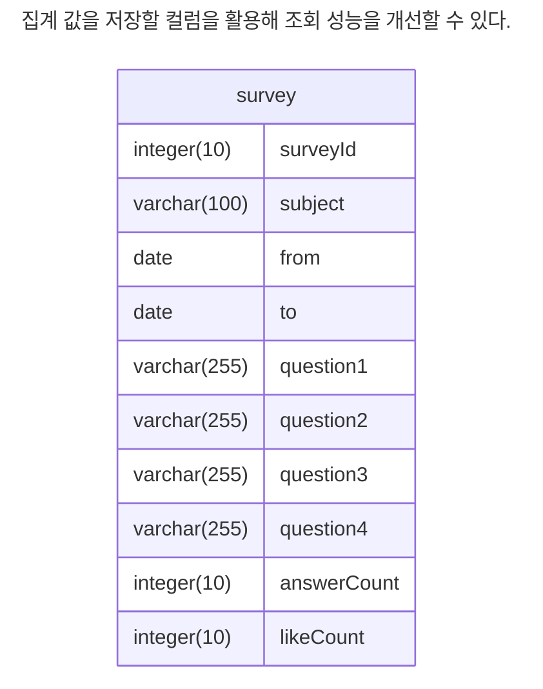

**1. 직접 DB 쿼리 업데이트 하기**

```sql
-- answer 테이블에 답변을 추가한다.
insert into answer values (...);

-- survey 테이블의 answerCount를 1 증가시킨다.
update survey set answerCount = answerCount + 1 where surveyId = :surveyId;

-- liked 테이블에 '좋아요'를 추가한다.
insert into liked values (...);

-- survey 테이블의 likeCount를 1 증가시킨다.
update survey set likeCount = likeCount + 1 where surveyId = :surveyId;
```

**2. 이벤트 발행**

```java
// 답변 저장 서비스
@Service
public class AnswerService {
    private final ApplicationEventPublisher eventPublisher;
    private final AnswerRepository answerRepository;

    public AnswerService(ApplicationEventPublisher eventPublisher, AnswerRepository answerRepository) {
        this.eventPublisher = eventPublisher;
        this.answerRepository = answerRepository;
    }

    @Transactional
    public void submitAnswer(Long surveyId, Long memberId, String answer1, String answer2, String answer3, String answer4) {
        Answer answer = new Answer(surveyId, memberId, answer1, answer2, answer3, answer4);
        answerRepository.save(answer);

        // 비동기 집계 이벤트 발행
        eventPublisher.publishEvent(new AnswerSubmittedEvent(surveyId));
    }
}

// 비동기 집계 이벤트 리스너
@Component
public class SurveyAnswerCountUpdater {
    private final SurveyRepository surveyRepository;
    private final AnswerRepository answerRepository;

    public SurveyAnswerCountUpdater(SurveyRepository surveyRepository, AnswerRepository answerRepository) {
        this.surveyRepository = surveyRepository;
        this.answerRepository = answerRepository;
    }

    @Async // 별도의 스레드에서 비동기로 처리된다.
    @EventListener
    public void handleAnswerSubmitted(AnswerSubmittedEvent event) {
        Long surveyId = event.getSurveyId();
        long count = answerRepository.countBySurveyId(surveyId);
        surveyRepository.updateAnswerCnt(surveyId, count);
    }
}
```

## 알아두면 좋을 몇 가지 주의 사항

### 쿼리 타임아웃

동시 사용자가 증가할 때 응답 시간이 길어지면 그에 반비례해 처리량은 감소한다.
하지만 단순히 처리량만 떨어지는 데서 끝나지 않는다.
예를 들어, 동시 접속이 증가하면서 특정 쿼리의 실행 시간이 15초 이상으로 늘어났다고 해보자.
사용자는 몇 초만 지나도 서비스가 느끼고 다시 몇 초 후에 재시도를 하게 된다.
이런식으로 재시도가 반복되면 동시에 처리해야 하는 요청 수가 기하급수적으로 늘어나고 서버 부하는 폭증하게 된다.

이런 상황을 방지하는 방법 중 하나는 쿼리 실행 시간을 제한(타임아웃) 설정 하는 것이다.
사용자는 에러 화면을 보게 되지만 서버 입장에서는 해당 요청을 정상적으로 종료(처리)한 셈이다.

쿼리 타임아웃은 서비스와 기능의 특성에 따라 다르게 설정해야 한다.
예를 들어, 실시간으로 처리해야 하는 서비스는 1초 이내로 설정하고, 상품 결제 기능은 보다 긴 타임아웃이 필요하다.

### 상태 변경 기능은 복제 DB에서 조회하지 않기

첫째, 주 DB와 복제 DB의 데이터가 일치하지 않을 수 있다. 주 DB에서 변경된 데이터는 다음 두 단계를 거쳐 복제 DB에 반영된다.

- 네트워크를 통해 복제 DB에 전달
- 복제 DB는 자체 데이터에 변경 내용을 반영

둘째, 트랜잭션 문제가 발생할 수 있다. 주 DB와 복제 DB 간 데이터 복제는 트랜잭션 커밋 시점에 이뤄진다.
주 DB의 트랜잭션 범위 내에서 데이터를 변경하고, 복제 DB에서 변경 대상이 될 수 있는 데이터를 조회하면 데이터 불일치로 인해 문제가 생긴다.

### 배치 쿼리 실행 시간 증가

배치에서 사용하는 쿼리의 실행 시간을 지속적으로 추적해야 한다.
데이터를 일정 크기로 나눠 처리하는 것도 좋다.

### 타입이 다른 컬럼 조인 주의

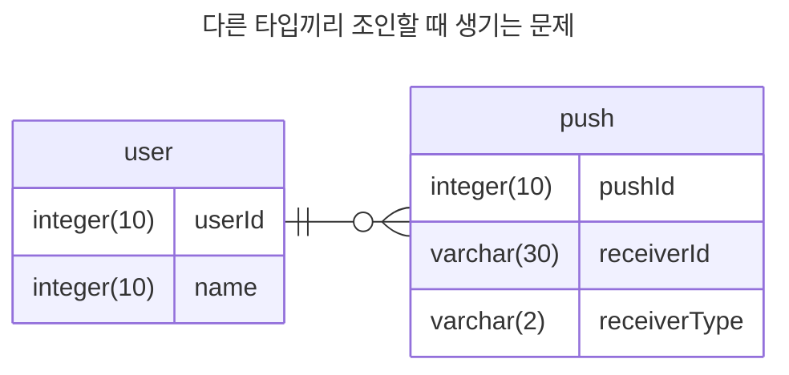

```sql
select u.userId u.name, p.*
from user u, push p
where u.userId = p.receiverId and p.receiverType = 'USER';
```

타입이 다른 두 컬럼의 조인을 할 때 컬럼의 값을 비교하는 과정에서 DB는 타입 변환을 수행한다.
userId는 INT 타입이고 receiverId는 VARCHAR(30) 타입이므로 DB는 VARCHAR(30) 타입을 INT 타입으로 변환한다.

```sql
select u.userId u.name, p.*
from user u, push p
where cast(u.userId as char character set utf8mb4 collate 'utf8mb4_unicode_ci' = p.receiverId
and p.receiverType = 'USER';
```

> [!NOTE]
> 문자열 타입을 비교할 때는 컬럼의 캐릭터셋이 같은지 확인해야 한다.
> 캐릭터셋이 다르면 DB는 캐릭터셋을 변환하는 과정에서 성능이 저하된다.

### 테이블 변경은 신중하게

테이블 변경 시 주의해야 하는 이유는 DB의 테이블 변경 방식 때문이다.
예를 들어, MySQL은 테이블을 변경할 떄 새 테이블을 생성하고 원본 테이블의 데이터를 복사한 뒤, 복사가 완료되면 새 테이블로 대체한다.
이 복사 과정에서는 UPDATE, INSERT, DELETE 같은 DML 작업을 허용하지 않기 때문에 복사 시간만큼 서비스가 멈춘다.

### DB 최대 연결 개수

- API 서버는 세 대다
- 트래픽이 증가하고 있어 수평 확장이 필요하다.
- DB 서버의 CPU 사용률은 20% 수준으로 여유가 있다.

트래픽이 증가를 감당하기 위해 API 서버를 추가할 수 있다.
그런데 새로 추가한 API 서버에서 DB 커넥션 생성에 실패한다면 무엇이 문제일까.
DB 서버 자원에는 여유가 있지만 API 서버에서 DB 연결되지 않는다면 DB에 설정된 최대 연결 개수를 확인해야 한다.

예를 들어 DB의 최대 연결 개수가 100개라고 가정하자.
API 서버의 커넥션 풀 개수가 30개일 때 API 서버를 네 대로 늘리면 필요한 커넥션 수는 120개다.
하지만 DB의 최대 연결 개수는 100개까지만 연결을 허용하므로 20개의 커넥션을 얻지 못하고 연결 실패가 발생하게 된다.
이 경우에는 DB의 최대 연결 개수를 늘려주는 것만으로도 해결할 수 있다.

단 주의할 점이 있다. DB 서버의 CPU 사용률이 70% 이상으로 높다면 연결 개수를 늘리면 안된다.
연결 수가 많아질수록 DB 부하는 증가하고 성능 저하가 발생할 수 있다.
이번 경우에는 먼저 캐시 서버 구성이나 쿼리 튜닝 같은 조치를 통해 DB 부하를 낮추고 필요할 때 연결 개수를 늘려야 한다.

## 실패와 트랜잭션 고려하기

```java
@Transactional
void signup(SignupRequest request) {
  // ...
  // 회원 가입
  memberRepository.save(request.toMember());

  // 이메일 발송
  try {
    mailSender.sendEmail(...);
  } catch (Exception e) {
    // 메일 발송 오류 무시
    // 로그를 기록해 모니터링
  }
}
```

# 4장. 외부 연동이 문제일 때 살펴봐야 할 것들

## 타임아웃


이런 문제를 완화할 수 있는 방법 중 하나는 연동에 대해 타임아웃을 지정한는 것이다.
A 서비스에서 B서비스로 요청을 보낼 때 B API 타임아웃을 걸어, 이후 B 서비스에서 응답이 오지 않더라도 A 서비스는 계속해서 요청을 처리할 수 있도록 하는 것이다.

### 2가지 타임아웃: 연결 타임아웃, 읽기 타입아웃

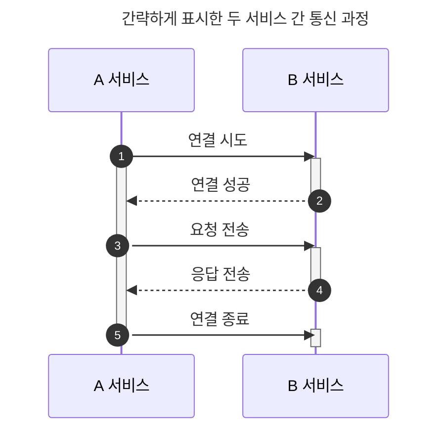

첫 번째 단계는 네트워크 연결 시도 단계다.
네트워크 상황이나 연결할 서버의 상태에 따라 연결에 오랜 시간이 걸릴 수 있다.
연결에 시간이 오래 걸리면 대기 시간도 함께 증가한다.
대기 시간이 무한정 길어지면 성능 문제가 발생하므로, 연결 타임아웃(connection timeout)을 설정해 대기 시간을 제한 해야 한다.

응답을 받기까지 시간이 오래 걸리면 앞서 말한 대기 시간 문제가 다시 발생한다. 따라서 읽기 타임아웃(read timeout)을 설정해 응답 대기 시간을 제한해야 한다.

처음 연동하는 서비스라면 타임아웃 시간을 아래와 같이 설정한 뒤, 추이를 보면서 조정하는 것이 좋다.

- 연결 타임아웃: 3 ~ 5초
- 읽기 타임아웃: 5 ~ 30초

읽기 타임아웃이 다소 길게 느껴질 수 있다.
하지만 처음부터 1~3초 정도로 짧게 설정하면 타임아웃 에러가 자주 발생할 수 있다.
게다가 타임아웃 시간이 너무 짧으면 연동 서비스가 정상처리했음에도 불구하고 타임아웃 에러가 발생할 수 있다.

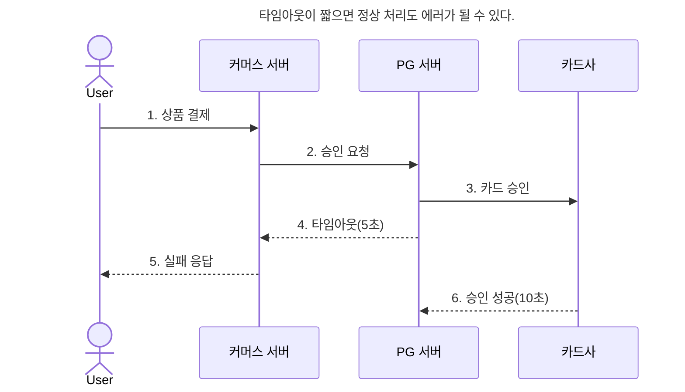

이 과정이 끝나면 고객의 카드로는 결제했지만 상품은 구매하지 못하는 불쾌한 상황에 빠진다.
커머스 서버가 PG 서버와의 통신에서 타임아웃을 15초로 설정했다면 발생하지 않았을 문제다.
결제처럼 민감한 기능은 읽기 타임아웃 시간을 약간 길게 설정해서 간헐적으로 연동 시간이 길어지더라도
정상적으로 처리할 수 있어야 한다.

**코드로 해당 상황 해결을 생각해보자.**

1. 결제 요청 응답 상태 테이블 설계

```java
@Entity
public class Payment {
    @Id @GeneratedValue
    private Long id;

    private String orderId;
    private String paymentKey; // PG사 결제 키
    private PaymentStatus status; // REQUESTED, SUCCESS, FAIL, PENDING

    private LocalDateTime requestedAt;
    private LocalDateTime completedAt;
    // ... 기타 필드
}

public enum PaymentStatus {
    REQUESTED, SUCCESS, FAIL, PENDING, REFUNDED
}
```

2. 결제 요청 서비스(타임아웃/에러 처리))

```java
@Service
public class PaymentService {
    private final PaymentRepository paymentRepository;
    private final PgClient pgClient;
    private final ApplicationEventPublisher eventPublisher;

    public PaymentService(PaymentRepository paymentRepository, PgClient pgClient, ApplicationEventPublisher eventPublisher) {
        this.paymentRepository = paymentRepository;
        this.pgClient = pgClient;
        this.eventPublisher = eventPublisher;
    }

    @Transactional
    public PaymentResponse pay(String orderId, PaymentRequestDto requestDto) {
        Payment payment = new Payment();
        payment.setOrderId(orderId);
        payment.setStatus(PaymentStatus.REQUESTED);
        payment.setRequestedAt(LocalDateTime.now());
        paymentRepository.save(payment);

        try {
            // PG 승인 요청 (타임아웃 15초)
            PgResponse pgResponse = pgClient.approve(requestDto, 15_000);

            if (pgResponse.isSuccess()) {
                payment.setStatus(PaymentStatus.SUCCESS);
                payment.setPaymentKey(pgResponse.getPaymentKey());
                payment.setCompletedAt(LocalDateTime.now());
                paymentRepository.save(payment);
                return PaymentResponse.success();
            } else {
                payment.setStatus(PaymentStatus.FAIL);
                paymentRepository.save(payment);
                return PaymentResponse.fail("결제 실패");
            }
        } catch (TimeoutException e) {
            // 타임아웃 발생: 상태를 PENDING으로 두고, 결과 조회 이벤트 발행
            payment.setStatus(PaymentStatus.PENDING);
            paymentRepository.save(payment);

            // 비동기 결제 결과 조회 이벤트 발행
            eventPublisher.publishEvent(new PaymentPendingEvent(payment.getId()));

            return PaymentResponse.fail("결제 결과 확인 중입니다. 잠시 후 알림을 확인해 주세요.");
        }
    }
}
```

3. 비동기 결제 결과 조회 서비스

```java
@Component
public class PaymentPendingEventListener {
    private final PaymentRepository paymentRepository;
    private final PgClient pgClient;
    private final NotificationService notificationService;

    public PaymentPendingEventListener(PaymentRepository paymentRepository, PgClient pgClient, NotificationService notificationService) {
        this.paymentRepository = paymentRepository;
        this.pgClient = pgClient;
        this.notificationService = notificationService;
    }

    @Async
    @EventListener
    public void handlePaymentPending(PaymentPendingEvent event) {
        Payment payment = paymentRepository.findById(event.getPaymentId()).orElseThrow();

        // 3회까지 5초 간격으로 결과 조회 시도
        for (int i = 0; i < 3; i++) {
            try {
                Thread.sleep(5000);
                PgResult result = pgClient.queryResult(payment.getOrderId());

                if (result.isSuccess()) {
                    payment.setStatus(PaymentStatus.SUCCESS);
                    payment.setCompletedAt(LocalDateTime.now());
                    paymentRepository.save(payment);
                    notificationService.notifySuccess(payment.getOrderId());
                    return;
                } else if (result.isFail()) {
                    payment.setStatus(PaymentStatus.FAIL);
                    paymentRepository.save(payment);

                    // 보상 트랜잭션(환불 처리 이벤트 발행)
                    eventPublisher.publishEvent(new PaymentCompensateEvent(payment.getOrderId()));

                    notificationService.notifyFail(payment.getOrderId());
                    return;
                }
            } catch (Exception e) {
                // 로깅 등
            }
        }
        // 3회 시도 후에도 결과 미확정 시, 관리자 알림 등 추가 처리
    }
}
```

```java
@Service
public class CompensationService {
    private final PaymentRepository paymentRepository;
    private final PgClient pgClient;

    @Transactional
    public void compensateIfNeeded(String orderId) {
        Payment payment = paymentRepository.findByOrderId(orderId)
            .orElseThrow();

        if (payment.getStatus() == PaymentStatus.SUCCESS && !상품_지급_완료(orderId)) {
            // 결제는 성공했으나 상품 미지급 → 환불 시도
            pgClient.refund(payment.getPaymentKey());
            payment.setStatus(PaymentStatus.REFUNDED);
            paymentRepository.save(payment);
        }
    }
}
```

4. 클라이언트
   1. 결제 결과 대기 화면에서: "결제 결과를 확인 중입니다."
   2. 주기적 폴링: "결제 결과를 확인 중입니다." (서버에서 결제 결과 상태 조회 API 제공 해야함)

### 타임아웃간의 차이 정리

- 연결 타임아웃: 서버와 연결을 맺는 데 걸리는 최대 시간
- 읽기 타임아웃:
  응답의 첫 바이트를 기다리는 시간
  서버가 연결은 됐지만, 응답을 늦게 보내거나 서버 내부 처리 지연이 있을 때 발생
- 소켓 타임아웃:
  응답 중간에 데이터가 오지 않을 때의 최대 대기 시간 (실제로는 읽기 타임아웃과 거의 동일하게 동작)  
  응답 중간에 데이터가 끊기면(서버가 chunked 응답을 보내다가 중간에 멈춤, 네트워크 중간에 끊김) 발생

```java
RequestConfig config = RequestConfig.custom()
    .setConnectTimeout(5000)      // 연결 타임아웃 (ms)
    .setConnectionRequestTimeout(5000) // 커넥션 풀에서 커넥션을 얻을 때까지 대기 시간
    .setSocketTimeout(10000)      // 소켓(읽기) 타임아웃 (ms)
    .build();

CloseableHttpClient client = HttpClients.custom()
    .setDefaultRequestConfig(config)
    .build();

HttpComponentsClientHttpRequestFactory factory = new HttpComponentsClientHttpRequestFactory(client);
RestTemplate restTemplate = new RestTemplate(factory);
```

## 재시도

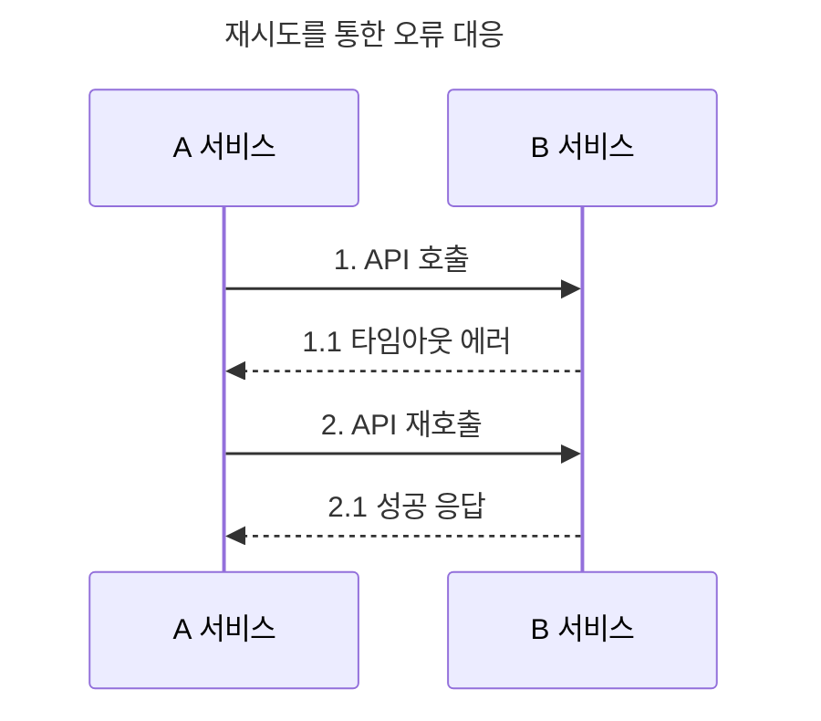

### 재시도 가능 조건

재시도를 통해 연동 실패를 줄일 수 있지만, 항상 재시도를 할 수 있는 것은 아니다.
연동 API를 다시 호출해도 되는 조건인지 확인해야 한다.

예를 들어 포인트 서비스가 제공하는 API를 호출해 포인트를 차감하는 상황을 생각해보자.
포인트 서비스를 호출하는 과정에서 **읽기 타임아웃**이 발생했을 때 재시도를 하게 되면 포인트 차감이 두 번 발생할 수 있다.

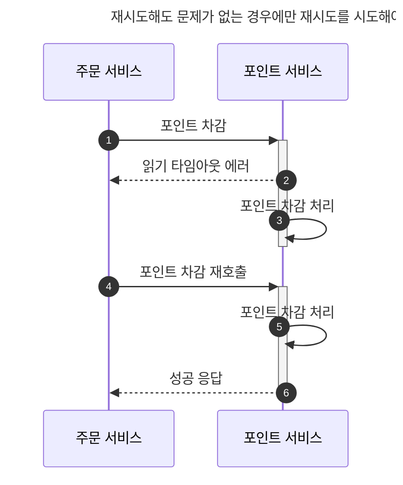

재시도를 해도 되는 조건은 다음 3가지로 정리할 수 있다.

- 단순 조회
- 연결 타임아웃
- 멱등성(idempotent)을 가진 변경 기능

읽기 타임아웃은 재시도할 때 주의해야 한다. 이 경우는 이미 연동 서비스가 요청을 처리하고 있는 중이기 때문이다.
읽기 타임아웃이 발생한 상황에서 재시도를 하면 포인트가 중복 차감되는 데이터 문제가 생길 수 있다.

상대를 변경하는 연동 API를 재시도할 때는 멱등성을 고려해야 한다. 멱등성이란 연산을 여러번 적용해도 결과가 달라지지 않는 성질을 말한다. 에를 들어, 좋아요 버튼을 클릭하는 API는 멱등성을 가진다.

한 사용자가 좋아요 버튼을 클릭하면 좋아요 수가 1 증가한다. 하지만 다시 클릭해도 좋아요 수는 1로 유지된다. 즉, 여러 번 클릭해도 결과는 같다는 것이다.

> [!TIP]
> 같은 API라도 실패 원인에 따라 재시도 여부를 결정해야 한다.
> 검증 오류가 발생한 경우에는 재시도를 해도 의미가 없다.

### 재시도 횟수와 간격

재시도를 무한정 할 수는 없다. 재시도 횟수만큼 응답 시간도 함께 늘어나기 때문이다.
대부분의 경우 1~2번의 정도의 재시도가 적당하다.
2번 재시도를 하면 총 3번 시도한 것이 되는데, 이 모두 실패한다면 간헐적인 오류보다는 다른 근본적인 문제일 가능성이 높다.

재시도 간격도 중요하다. 네트워크 연결 상태가 6초간 좋지 않은 상황을 가정해보자.
여러 차례 재시도 할 때는 재시도 간격을 점진적으로 늘리기도 한다.

### 재시도 폭풍(Retry Storm) 안티패턴

재시도를 통해 성공 가능성을 높일 수 있지만, 반대로 연동 서비스에는 더 큰 부하를 줄 수 있다.
읽기 타임아웃이 발생한 경우, 재시도를 통해 연동 서비스에 부하를 줄 수 있다.
따라서 재시도를 검토할 때는 연동 서비스의 성능 상황도 함께 고려해야 한다.

## 동시 요청 제한

A 서비스가 B 서비스에 의존하고,B 서비스가 동시 요청 100개까지 처리 가능할 때 A 서비스의 동시 요청이 300개라면
A 서비스도 B 서비스에 대한 동시 요청을 100개로 제한해야 하는지에 대한 고민이 된다.

A 서비스가 300개 동시 요청을 그대로 B 서비스에 전달하면 B 서비스는 100개만 정상 처리, 나머지는 대기/실패/타임아웃이 발생할 수 있습니다. 즉 전체 장애, 타임아웃, 큐 부하가 발생할 수 있습니다.

```java
@Bulkhead(name = "bServiceBulkhead", type = Bulkhead.Type.SEMAPHORE)
@RateLimiter(name = "bServiceRateLimiter")
public Response callBService(Request req) {
    return bServiceClient.call(req);
}
```

```yaml
// application.yml
// 동시에 100개 요청, 초과 요청은 최대 5초 대기 후 에러
resilience4j:
  bulkhead:
    instances:
      bServiceBulkhead:
        maxConcurrentCalls: 100
        maxWaitDuration: 5s

// 1초에 100건까지만 허용, 초과 요청은 최대 5초 대기 후 에러
resilience4j:
  ratelimiter:
    instances:
      bServiceRateLimiter:
        limitForPeriod: 100
        limitRefreshPeriod: 1s
        timeoutDuration: 5s
```

```java
// Reactor의 flatMap(concurrency) 활용
Flux.fromIterable(requests)
    .flatMap(req -> callBService(req), 100) // 동시 100개 제한
    .subscribe();
```

- application.yml에서 maxConcurrentCalls: 100 설정

제한하지 않으면, B 서비스 장애 → A 서비스 장애 → 전체 장애로 확산될 수 있다.

## 서킷 브레이커

서킷 브레이커는 누전 차단기와 비슷하게 동작한다. 과전류가 흐르면 차단기가 내려가 전기를 끊는 것처럼,
서킷 브레이커도 과도한 오류가 발생하면 연동을 중지시키고 바로 에러를 응답한다.

서킷 브레이커는 닫힘(closed), 열림(open), 반전(half-open) 세 가지 상태로 나뉜다.


보통 임계치는 다음 조건 중 하난를 사용한다.

- 시간 기준 오류 발생 비율: 예) 10초 동안 오류 비율이 50% 초과
- 개수 기준 오류 발생 비율: 예) 100개 요청 중 오류 비율이 50% 초과

열림 상태가 되면 연동 요청은 수행하지 않고, 바로 에러 응답을 리턴한다.
열림 상태는 지정된 시간 동안 유지된다.
이 시간이 지나면 반 열림 상태로 전환된다.
반 열림 상태에서는 일부 요청에 한해 연동 요청을 시도한다.
일정 개수 또는 일정 시간 동안 반 열림 상태를 유지하며, 이 기간 동안 연동에 성공하면 다시 닫힘 상태로 전환된다.

서킷 브레이커가 열려 있는 동안은 연동 서비스에 요청이 전달되지 않기 때문에 연동 서비스가 과부화 상황에서 벗어날 수 있는 기회도 생긴다.

## 외부 연동과 DB 연동

### 외부 연동과 트랜잭션 처리

- 외부 연동에 실패했을 때 트랜잭션을 롤백
- 외부 연동은 성공했지만 DB 연동에 실패해 트랜잭션을 롤백

**외부 연동에 실패했을 때 트랜잭션을 롤백**

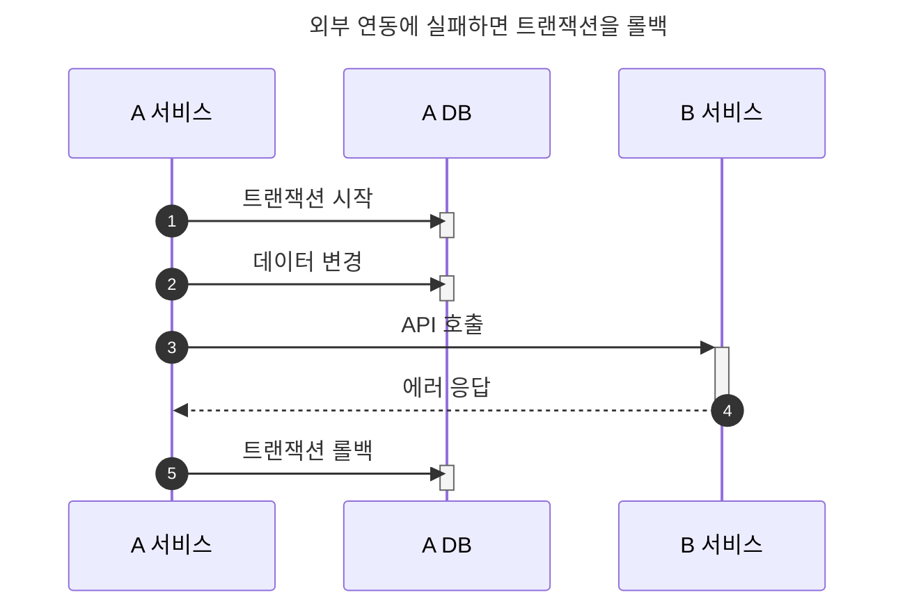

하지만 읽기 타임아웃이 발생해 트랜잭션을 롤백할 때는, 외부 서비스가 실제로는 성공적으로 처리했을 가능성을 염두에 두어야 한다.

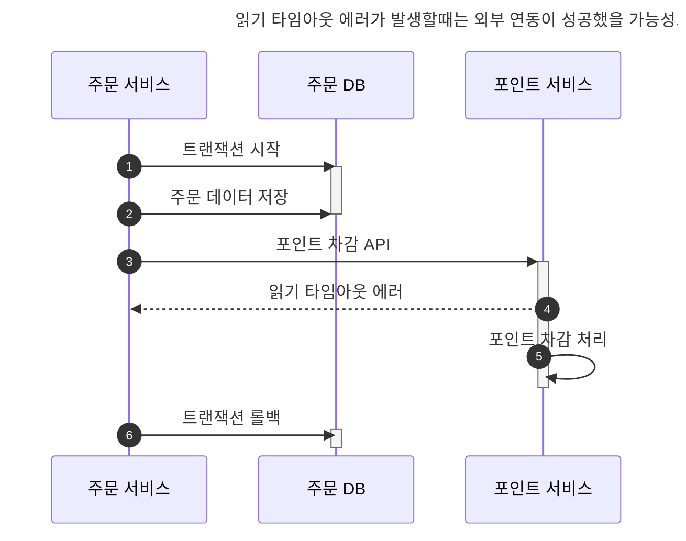

트랜잭션을 롤백했는데 외부 서비스가 실제로는 성공했을 경우, 두 가지 방법 중 하나를 검토해야 한다.
첫 번째는 일정 주기로 두 시스템의 데이터가 일치하는지 확인하고 보정하는 방법이다.
예를 들어, 주문 서비스와 포인트 서비스가 하루에 한 번씩 전날 포인트 사용 내역을 비교해 불일치 건이 있는지 확인하는 식이다.
불일치 건이 발견되면 수동으로 또는 자동으로 보정한다.

두 번째는 성공 확인 API를 호출하는 방식이다. 읽기 타임아웃이 발생한 경우, 일정 시간 후에 이전 호출이 실제로 성공했는지 확인하는 API를 호출한다.
이때 성공 응답이 오면 트랜잭션을 지속하고, 실패 응답이 오면 트랜잭션을 롤백한다. 이 방식은 연동 서비스가 성공 여부를 알려주는 API를 제공할 때만 사용할 수 있다.

이 방식의 변형으로 취소 API를 호출하는 방법도 있다. 읽기 타임아웃이 발생한 뒤 일정 시간후에 취소 API를 호출하는 것이다.
연동 서비스는 취소할 대상이 있으면 취소 처리를 수행한뒤 성공 응답을 주고, 취소할게 없다면 아무 동작 없이 성공 응답만 반환한다.

두 시스템 간 데이터 일관성이 중요한 기능이라면 정기적으로 데이터 일치를 확인하는 프로세스를 갖추는 것이 바람직하다.

### 외부 연동은 성공했는데 DB 연동에 실패해서 트랜잭션을 롤백

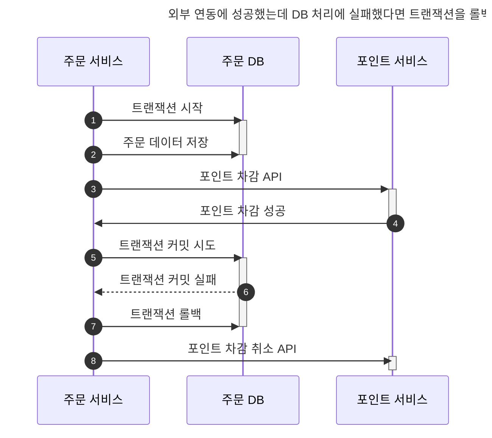

취소 API가 없거나 취소에 실패할 수도 있기 때문에 데이터 일관성이 중요한 서비스라면 일정 주기로 데이터가 맞는지 비교하는 프로세스를 갖추는 것이 좋다.

### 외부 연동이 느려질 때 DB 커넥션 풀 문제

DB 트랜잭션 범위 안에서 외부 연동을 수행할 때, 트랜잭션 처리 외에도 주의해야 할 점이 더 있다.
바로, 외부 연동이 느려지면서 발생하는 커넥션 풀 부족 현상이다. 예를 들어, 기능 실행에 5초가 걸리는 상황을 생각해보자.

1. 커넥션 풀에서 커넥션을 얻는다.
2. 0.1초 걸리는 DB 쿼리를 실행한다.
3. 외부 연동 API를 호출(API 호출에 5초 소요)
4. 0.1초 걸리는 DB 쿼리를 실행한다.
5. 커넥션을 반납한다.

이 시나리오에서 외부 연동을 제외하면, 실제 DB 커넥션이 사용되는 시간은 0.2초에 불과하다.
하지만 외부 연동에 4.8초가 걸리면서 커넥션은 총 5초 동안 사용 상태로 있게 된다.
즉, DB 쿼리를 실행하지 않아도 커넥션이 점유된 상태가 지속되는 것이다.

커넥션 풀의 크기가 5라고 가정해보자. 외부 연동을 포함해 전체 처리 시간은 5초 걸리는 서비스다.

요청이 1초 간격으로 1개씩 들어오면 4초 시점에는 요청 1부터 요청 5까지 총 5개의 요청이 실행 중이 된다.
이때 커넥션 풀에는 남은 커넥션이 0개다.

5초 시점이 되면 요청 1이 종료되면서 커넥션이 반환된다. 이후 요청 6이 해당 커넥션은 풀에서 가져와 바로 사용한다.
요청 6은 대기 시간 없이 커넥션을 확보할 수 있다.


외부 연동 서비스 시간이 늘어나면 DB 커넥션을 점유하는 시간이 길어지게 된다.
이에 따라 이후 요청 또한 커넥션을 확보하지 못하고 대기하게 된다.

DB 연동과 무관하게 외부 연동을 실행할 수 있다면, DB 커넥션을 사용하기 전이나 후에 외부 연동을 시도하는 방안도 고려해볼 수 있다. 이렇게 하면 외부 연동 시간이 길어지더라도 DB 커넥션 풀이 포화되는 상황을 방지할 수 있다.

단, 이 방식은 외부 연동이 트랜잭션 범위 밖에서 실행되기 때문에 트랜잭션 커밋 이후 외부 연동이 실패하면 롤백이 불가능하다는 점을 고려해야 한다. 이 경우에는 실패한 외부 연동에 대한 후처리를 반드시 고려해야 한다.
트랜잭션으로 반영된 데이터를 되돌리는 보상 트랜잭션을 사용하는 방법 또는 기능 특성에 따라 데이터를 후보정하는 방법 등이 있다.

## HTTP 커넥션 풀

DB 커넥션 풀이 DB 연결에 걸리는 시간을 줄여 성능을 높이는 것처럼 HTTP 연결도 HTTP 연결도 커넥션 풀을 사용하면 연결 시간을 줄일 수 있어 응답 속도 향상에 도움이 된다.

- HTTP 커넥션 풀의 크기
- 풀에서 HTTP 커넥션을 가져올 때까지 대기하는 시간
- HTTP 커넥션을 유지하는 시간(Keep-Alive)
