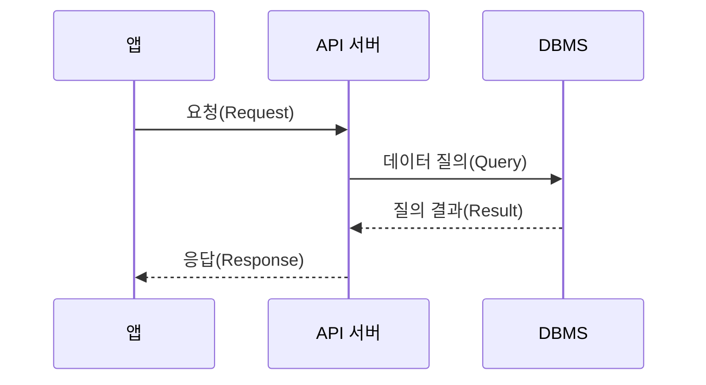

### ToC

- [2장. 느려진 서비스, 어디부터 봐야 할까](#2장-느려진-서비스-어디부터-봐야-할까)
  - [응답 시간(Response Time)](#응답-시간response-time)
  - [처리량(Throughput)](#처리량throughput)
  - [병목 지점(Bottleneck) 찾기](#병목-지점bottleneck-찾기)
  - [DB 커넥션 풀](#db-커넥션-풀)
    - [커넥션 풀 크기](#커넥션-풀-크기)
    - [커넥션 대기 시간](#커넥션-대기-시간)

# 2장. 느려진 서비스, 어디부터 봐야 할까

다양한 지표가 성능과 관련이 있다. 네트워크 속도, 디스크 속도, CPU 속도, 메모리 크기, GC 속도 등 다양한 지표가 성능과 관련이 있다.
이런 다양한 지표 중에서 서버 성능과 관련 있는 중요한 지표를 2가지 꼽자면 응답 시간(Response Time)과 처리량(Throughput)이다.

## 응답 시간(Response Time)

**그림 1.** 앱, API 서버, DBMS 간의 시퀀스 다이어그램

1. API 요청: 서버에 연결 + 서버로 데이터 전송
2. SQL 실행, 응답 생성 등: 서버 실행
3. API 응답: 클라이언트로 데이터 전송

응답 시간은 다음과 같이 2가지로 나누어 측정하기도 한다.

- TTFB(Time to First Byte): 첫 번째 바이트가 도착하기까지의 시간
- TTLB(Time to Last Byte): 마지막 바이트가 도착하기까지의 시간

파일 다운로드처럼 전송할 데이터가 크거나 네트워크 속도가 느리면 TTFB와 TTLB의 차이가 커질 수 있다.

서버 개발자는 주로 서버의 처리 시간을 확인한다. 서버 처리 시간은 다음과 같은 요소를 포함한다.

- 로직 수행(if, for 등)
- DB 연동(SQL 실행)
- 외부 API 연동
- 응답 데이터 생성(전송)

이 중에서도 DB 연동과 외부 API 연동이 큰 비중을 차지한다. 실제 한 요청의 처리 시간을 측정한 결과다.

- 전체 처리 시간: 348ms
- API 연동 1(External API) 186ms(53%)
- API 연동 2(Internal API) 44ms(13%)
- DB 연동(SQL 실행 6회): 101ms(29%)
- 응답 데이터 생성: 17ms(5%)

이처럼 API 연동과 DB 연동이 전체 처리 시간의 대부분을 차지하는 경우가 많다. 이러한 이유로 응답 시간을 줄일 때 DB 연동과 API 연동 시간에 집중한다.

## 처리량(Throughput)

처리량은 단위 시간당 처리할 수 있는 요청의 수를 의미한다. 흔히 TPS(Transaction Per Second: 초당 처리한 트랜잭션 수), RPS(Request Per Second) 등으로 표현한다.

최대 TPS는 시스템이 처리할 수 있는 최대 요청 수를 의미한다. 동시에 들어오는 요청 수가 최대 TPS를 초과하면 서버는 초과한 요청을 나중에 처리한다. 예를 들어, 최대 TPS가 5인 서버에 동시에 7개의 요청이 들어오면 5개는 즉시 처리하고 나머지 2개는 대기한다. 나머지 2개는 5개의 요청이 끝난 후에야 처리된다. 사용자 입장에서는 나중에 처리된 2개의 요청은 **실제 처리된 시간과 더불어서 대기 시간도 포함된다.**

응답 시간의 증가는 사용자 이탈로 이어질 수 있다. 이를 방지하려면 다음 2가지 방법을 고려해야 한다.

1. 서버가 동시에 처리할 수 있는 요청 수를 늘려 대기 시간을 줄인다.
2. 처리 시간 자체를 줄여 대기 시간을 줄인다.

> [!NOTE]
> 성능을 개선하려면 먼저 현재 서버의 TPS와 응답 시간을 알아야 한다.
> 막연히 성능이 느리다 말하면서 이것저것 시도하면 안 된다.
> 트래픽이 많은 시간대의 TPS와 응답 시간이 얼마인지 측정하고,
> 이 결과를 바탕으로 목표 TPS와 응답 시간을 설정하고 효과적인 성능 개선안을 도출해야한다.
>
> **TPS를 확인하는 가장 간단한 방법은 모니터링 시스템을 활용하는 것이다.**

## 병목 지점(Bottleneck) 찾기

트래픽이 증가하면서 성능 문제가 발생하는 주된 이유는 시스템이 수용할 수 있는 최대 TPS를 초과하는 트래픽이 유입되기 때문이다. 시스템이 제공할 수 있는 최대 TPS를 높이지 않으면 증가하는 트래픽을 적절히 처리할 수 없다.

TPS를 높이려면 먼저 성능 문제가 발생하는 지점을 찾아야 한다. 문제 지점을 찾는 간단한 방법은 처리 시간이 오래 걸리는 작업을 식별하는 것이다.

TPS를 높이기 위해 무턱대고 서버를 추가해서는 안 된다.

> [!NOTE]
>
> **병목 지점(Bottleneck)을 확인하는 가장 간단한 방법은 APM 시스템을 활용하는 것이다.**

## DB 커넥션 풀

DB를 사용하려면 다음과 같이 3단계의 과정이 필요하다.

1. DB에 연결한다.
2. SQL을 실행한다.
3. 사용이 끝나면 DB 연결을 종료한다.

서버와 DB는 네트워크 통신을 통해 연결된다. 이때 네트워크 연결을 생성하고 종료하는 데 걸리는 시간은 0.5초에서 1초 이상 소요되기도 한다. 이 시간이 길게 느껴지지 않을 수도 있지만 실제로는 매우 긴 시간이다. 예를 들어, 10ms에 불과한 짧은 쿼리를 실행하기 위해 연결과 종료에 50ms(0.05초)가 소요된다면 전체 처리 시간은 60ms(0.06초)가 된다. 단순히 계산해도 전체 처리 시간의 80% 이상이 DB 연결 및 종료에 쓰이게 된다.

매 요청마다 DB를 연결하고 종료하면 트래픽이 증가하면 이러한 현상은 더 두드러진다. 매 요청마다 DB를 연결하고 종료하면 트래픽이 증가할 때 급격하게 처리량이 떨어지기도 한다. 이런 문제를 피하기 위해 DB 커넥션 풀을 사용한다. DB 커넥션 풀은 DB에 연결된 커넥션을 미리 생성해서 보관한다. 애플리케이션은 DB 작업이 필요할 때 풀에서 커넥션을 가져와 사용하고, 작업이 끝나면 다시 풀에 반환한다.

커넥션 풀 설정중 중요한 설정은 다음과 같다.

- 커넥션 풀 크기(또는 최소, 최대 크기)
- 풀에 커넥션이 없을 때 커넥션을 구할 때까지 대기할 시간
- 커넥션의 유지 시간(최대 유휴 시간, 최대 유지 시간)

### 커넥션 풀 크기

커넥션 풀 크기는 커넥션 풀에 보관할 수 있는 커넥션의 개수를 의미한다. 서버는 주로 DB와 통신을 하기 때문에, DB 커넥션 풀 크기를 잘못 설정하면 성능에 큰 영향을 미친다. 다음과 같은 상황을 가정해보자.

- 커넥션 풀 크기는 5다.
- 한 요청에서 쿼리를 실행하는데 1초 걸린다.
- 계산을 쉽게 하기 위해 데이터 전송 시간은 무시한다.

서버에 6개 요청이 동시에 들어왔을 때 이 중 5개 요청은 풀에서 커넥션을 가져올 수 있다. 반면 1개 요청은 다른 요청이 커넥션을 반환할 때까지 대기해야 한다.

커넥션 풀의 구현 방식에 따라 다르지만 일반적인 커넥션 풀은 최소 크기와 최대 크기를 설정할 수 있다. 최소 크기는 커넥션 풀에 항상 유지할 커넥션의 개수를 의미한다. 커넥션 풀의 크기를 5로 설정하고 최소 크기를 2로 설정하면 커넥션 풀은 항상 2개의 커넥션을 유지한다. 나머지 3개는 필요할 때마다 생성된다. 이때 커넥션 풀의 크기를 5로 설정하면 최대 5개의 커넥션을 유지할 수 있다.

> [!Tip]
> 트래픽이 순간적으로 급증하는 패턴을 보인다면 커넥션 풀의 최소 크기를 최대 크기에 맞추는 것이 좋다.
> 트래픽이 점진적으로 증가할 때는 DB 연결 시간이 성능에 큰 영향을 주지 않지만 트래픽이 급증할 때는
> DB 연결도 성능 저하의 주요 원인이 될 수 있기 때문이다.

### 커넥션 대기 시간

대기 시간이란 풀에 사용할 수 있는 커넥션이 없을 때
